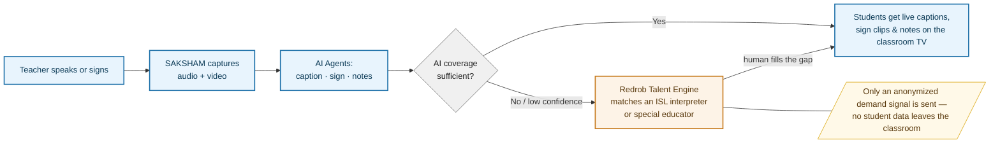
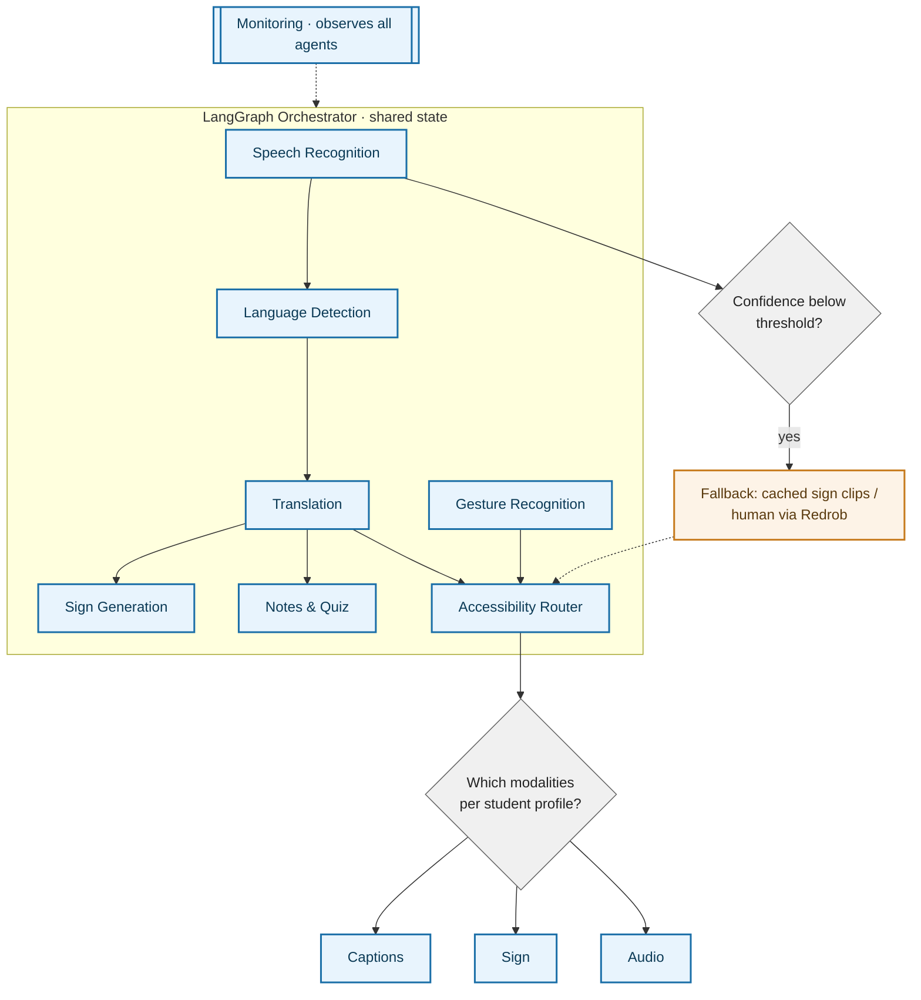
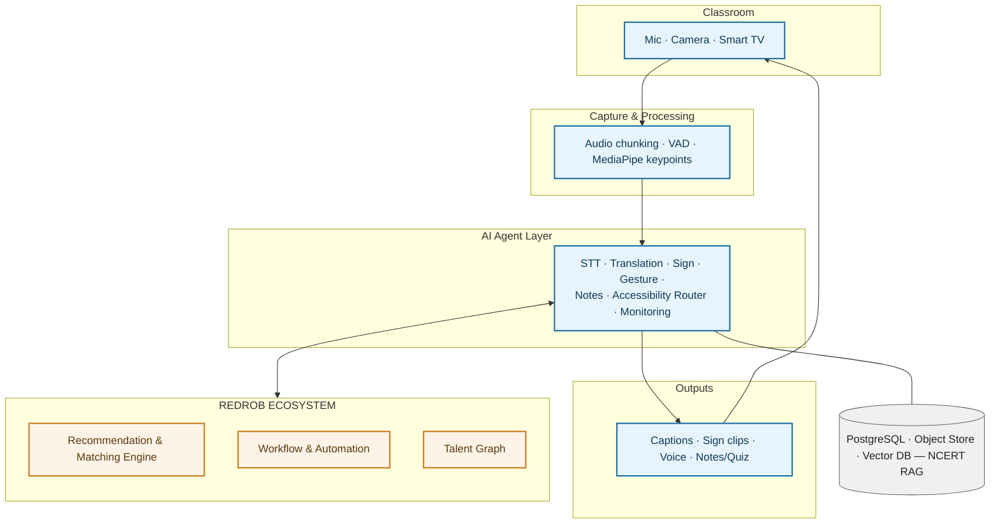
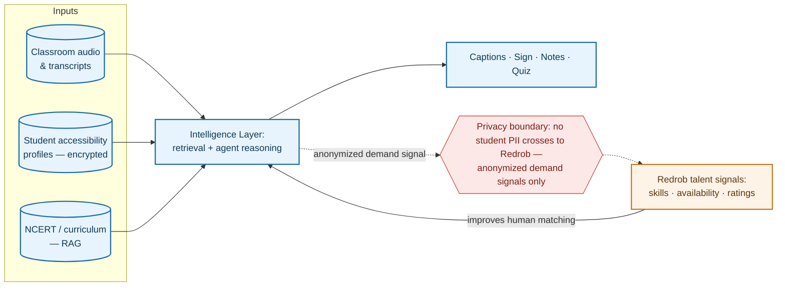
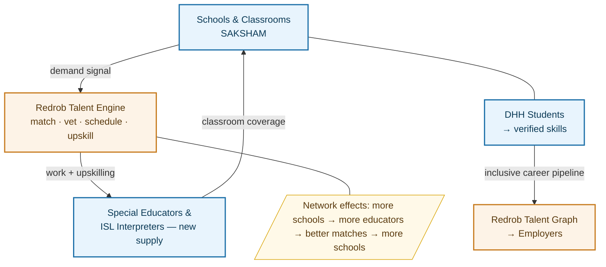

# SAKSHAM AI — Track 2 (Ideathon) Submission Package
**Event:** India Runs by Redrob AI · **Track 2 · Problem Statement 1 — The AI Systems Architect: Reimagining Work**
**Deadline:** 2 July 2026 (verify exact time on Hack2skill dashboard)
**Positioning:** Keep the classroom-accessibility product; wrap Redrob in as the talent/discovery engine (load-bearing bridge).

---

## HOW TO FINISH (assembly checklist)

1. Open the official template `[IDEATHON] Track 1 Submission Template.pptx` (Track 2 uses the same template).
2. Slides 2 & 3 are pre-filled Redrob context — leave them.
3. Paste the slide copy below into slides 4–15.
4. Render each Mermaid diagram at https://mermaid.live → export PNG (transparent, 2x scale) → drop onto slides 8, 9, 10, 11, 13.
5. (Optional, only if time) restyle each PNG with nano-banana for a polished look — prompts are in the earlier chat.
6. File → Export → PDF. Submit the PDF.

**Stats footnote to add on slide 5** (small text): *"Figures are cited estimates from Census 2011, NAD, and sector studies; ranges vary by methodology."*

---

## SLIDE COPY (paste-ready)

### Slide 1 — Title
**SAKSHAM AI — The Inclusive Classroom Intelligence Layer**
*Reimagining work in every Indian classroom — built on the Redrob ecosystem*
Track 2 · Problem Statement 1: The AI Systems Architect

### Slide 4 — Team & Problem Statement
- **Team Name:** [your team name]
- **Team Members:** [names]
- **Problem Statement:** Track 2 · PS1 — The AI Systems Architect: Reimagining Work

### Slide 5 — Problem Definition · *The classroom that leaves millions behind*
- Deaf/hard-of-hearing students and speech-impaired teachers in mainstream Indian classrooms get **no real-time accessibility** — the lecture happens, minus the part that matters.
- **Who:** 18M+ DHH Indians; only ~5% of deaf children attend school and ~1% get a quality education; speech-impaired teachers can't project authority across a room of 40.
- **Why today's approach fails:** human interpreters cost ₹15–25k/month and barely exist — ~98% of special educators lack sign-language skills, and there are only 387 DHH schools nationwide. Schools can neither afford nor find the humans to fix this.

### Slide 6 — Opportunity & Vision · *The hardware is already in the room*
- Every classroom already has the device needed: a mic, a teacher's laptop, a smart TV/projector (rolled out under Samagra Shiksha / PM SHRI / ICT@Schools).
- **Policy tailwind:** RPWD Act 2016 + NEP 2020 mandate inclusive education and ISL standardization — the demand is legislated; the tooling is missing.
- **Vision:** make any classroom accessible for ~₹1–2k, and connect it to a lifelong pathway — accessible classroom → verified skills → career — through the Redrob ecosystem.

### Slide 7 — Solution Overview · *SAKSHAM AI*
- **What:** one mic input fans out in real time into live captions, ISL sign clips, gesture-to-voice for speech-impaired teachers, and auto notes + quizzes for every student.
- **Built on India's sovereign AI stack:** speech runs on **Sarvam AI** (Saaras STT + Bulbul TTS + Mayura translation — 22 Indian languages, speaker diarization, code-mixing), with **Bhashini** as the free/govt-subsidized fallback — purpose-built for Indian classrooms, not generic English models.
- **AI-native, not AI-assisted:** a multi-agent system that *autonomously* routes the right modality per student profile, self-monitors confidence and latency, and degrades gracefully — no manual teacher toggling.
- **Built on Redrob:** when AI coverage runs out, SAKSHAM taps Redrob's talent engine to discover and match a human interpreter/educator — *intelligent candidate discovery, applied to accessibility.*

### Slide 8 — User Journey / Workflow · *(diagram)*
- Teacher speaks or signs → SAKSHAM captions, signs, and takes notes live on the classroom TV.
- When confidence drops or a sign is out-of-vocabulary, the system doesn't fail silently — it raises a **demand signal** to Redrob, which matches a qualified interpreter/special educator.
- **Privacy by design:** only an anonymized demand signal leaves the classroom — never student data.

### Slide 9 — AI Logic & Decision Flow · *(diagram)*
- AI intervenes at every stage: speech recognition, language detection, translation, gesture recognition, sign generation, note/quiz generation, accessibility routing.
- Decisions are **confidence-gated**: below threshold → cached sign clips or a human via Redrob; the Accessibility Router picks modalities per each student's registered profile.
- A **Monitoring agent** observes every node and can force graceful degradation (e.g., captions-only) under load.

### Slide 10 — System Architecture · *(diagram)*
- Four layers: classroom hardware → capture/processing → AI agent layer (**Sarvam AI** for Indian-language STT/TTS/translation; LLM for notes/quiz) → multimodal outputs back to the TV.
- The **Redrob ecosystem** (recommendation & matching, workflow automation, talent graph) plugs into the agent layer — SAKSHAM builds on it rather than rebuilding hiring/matching from scratch.
- **Phased compute:** Phase 1 browser + cloud APIs (buildable now); Phase 2 edge box for offline/low-connectivity; Phase 3 dedicated appliance.

### Slide 11 — Data, Context & Intelligence · *(diagram)*
- Powered by: classroom audio/transcripts, encrypted student accessibility profiles, and NCERT/curriculum content via RAG.
- **Redrob context makes it smarter:** Redrob's talent signals (educator skills, availability, ratings) drive precise human matching a generic job board can't.
- **Hard privacy boundary:** no student PII ever crosses to Redrob — only anonymized demand signals. Compliant-by-design under the DPDP Act 2023.

### Slide 12 — Scalability & Technical Feasibility
- **Buildable today:** the MVP runs on Next.js + FastAPI + **Sarvam AI** (STT/TTS/translation) + an LLM for notes/quiz — no new hardware, ~₹1–2k accessories per classroom.
- **Running cost is low & STT-dominated:** ~₹1–4/classroom-hour on **Bhashini** (free/govt), ~₹50–90/hr on **Sarvam AI** (₹1.5/min — best Indian-language accuracy + code-mixing). TTS can run free in-browser; notes/quiz LLM < ₹1/lecture; sign clips static & cached. ≈ **₹80–7,000/month per classroom** by provider mix — still 1–2 orders below **₹15–25k/month** for a human interpreter.
- **Scales edge-first:** most inference is absorbed at the classroom; the cloud tier (Kubernetes, vLLM batching) handles only heavy generation and analytics — the same design serves 1 or 100,000 classrooms. **Edge migration (Phase 2) triggers when recurring API cost exceeds amortized hardware.**
- **Honest challenges:** generative ISL is a research gap (phased: cached clips now → generative later with ISLRTC); code-switching and connectivity handled by graceful degradation.

### Slide 13 — Redrob Ecosystem Integration · *(diagram)*
- **Leverages:** Redrob's recommendation/matching, discovery, communication, and upskilling workflows.
- **Introduces a new vertical:** an *EdAccessibility talent marketplace* — schools discover and book ISL interpreters and special educators on Redrob's rails.
- **Strengthens the ecosystem:** new demand (schools), new upskilled supply (educators), and a long-term inclusive-talent pipeline (DHH students → verified skills → Redrob talent graph → employers). Network effects on both sides.

### Slide 14 — Impact & Success Metrics
- **Access:** # classrooms made accessible; cost/classroom (~₹1–2k vs ₹15–25k/mo interpreter).
- **Learning:** DHH student comprehension/engagement; notes/quiz usage.
- **Ecosystem:** educators discovered + upskilled via Redrob; students entering skilled career pathways.
- **Auditable:** every caption, sign, and fallback logged as an accessibility event — RPWD Act compliance evidence out of the box.

### Slide 15 — Future Roadmap
- **Year 1:** harden MVP; pilot in real classrooms; capture accuracy + cost data.
- **Year 2:** multi-school + hybrid edge deployment; launch the Redrob EdAccessibility educator marketplace.
- **Year 3:** generative ISL avatars (ISLRTC partnership); activate the student→career pipeline into Redrob's talent graph; pursue state-government scale (NEP 2020 aligned).

---

## DIAGRAMS (Mermaid — render at mermaid.live)

### Diagram 1 — Slide 8: User Journey / Workflow

### Diagram 2 — Slide 9: AI Logic & Decision Flow

### Diagram 3 — Slide 10: System Architecture

### Diagram 4 — Slide 11: Data, Context & Intelligence

### Diagram 5 — Slide 13: Redrob Ecosystem Integration

---

## APPENDIX — RUNNING COST MODEL (speaker notes / judge Q&A)

**How each piece runs (Phase 1, cloud MVP):**
- **STT** — streaming API, VAD-gated (only speech, not silence, is billed). **Primary: Sarvam AI Saaras V3** (22 Indian languages, speaker diarization, code-mixing; ₹1.5/min ≈ ₹90/hr raw, ~₹54/hr VAD-gated). Free alternative: **Bhashini** (govt, ~₹0–3/hr). English-only & cheaper: OpenAI Whisper (~₹30/hr), Deepgram (~₹22/hr) — but weak on Indian-accented/code-switched classroom speech. Phase 2: self-hosted on edge → ~₹0 marginal.
- **TTS** — browser-native `SpeechSynthesis`, runs on-device → **₹0** for MVP. Quality upgrade: **Sarvam AI Bulbul V3** (25+ voices, 11 Indian languages, WebSocket streaming, emotion control) or self-hosted Piper.
- **LLM (notes/quiz)** — one batched call at lecture end (~10k in / 3k out tokens, GPT-4o-mini/Haiku-class) → **< ₹1/lecture**.
- **Sign clips** — static video files from object store, cached client-side → ~₹0.
- **Translation (optional)** — **Sarvam AI Mayura** (all 22 official languages), IndicTrans2 (open-source, self-host), or Bhashini → free/cheap.

**Per classroom-hour (≈ ₹85/USD):**

| Component | Sarvam AI (Indian-optimized) | Bhashini (free/govt) |
|---|---|---|
| STT (VAD-gated) | ~₹54 (₹1.5/min) | ₹0–3 |
| TTS | ₹0 (browser) / Bulbul | ₹0 |
| LLM notes/quiz | ~₹0.5 | ~₹0.5 |
| Sign clips | ~₹0 | ~₹0 |
| **Total** | **~₹50–55/hr** | **~₹1–4/hr** |

**Monthly per classroom (80 hrs = 4hr × 20 days):** Sarvam ≈ ₹4,000–4,400; Bhashini ≈ ₹80–320. Human interpreter ≈ ₹15,000–25,000.

**Cloud hosting (shared, not per-classroom):** 1 small VM + Postgres + object store ≈ $25–50/month serves many concurrent sessions at pilot scale; amortizes to near-zero per classroom.

**Edge migration trigger (Phase 2):** switch STT to on-device when recurring API cost per classroom exceeds amortized cost of a ₹8–20k device over ~2–3 yrs, OR connectivity is unreliable, OR data-residency is required.

**Do NOT** quote a single flat number — cost depends on provider. Use the range: **₹1–4/hr on Bhashini → ~₹54/hr on Sarvam** (best Indian-language quality). Even the top end is far below a human interpreter, and it sets up the Phase-2 edge story (self-host STT to cut recurring cost).
