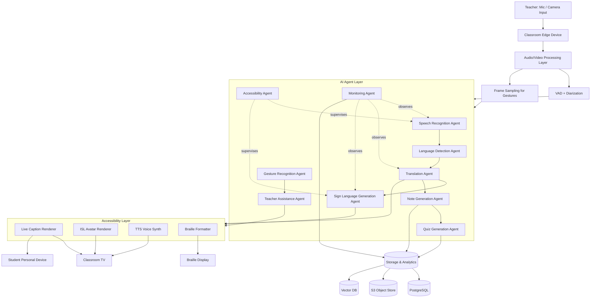
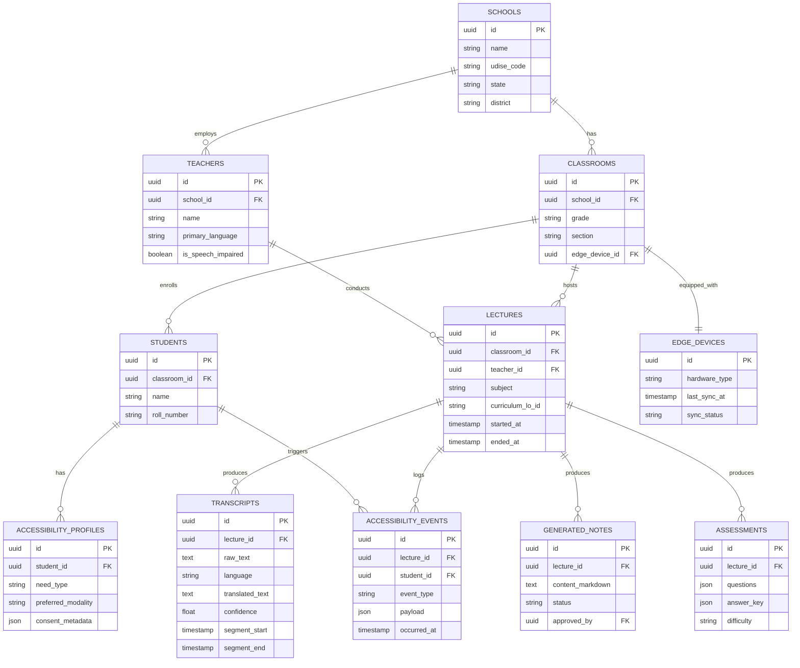
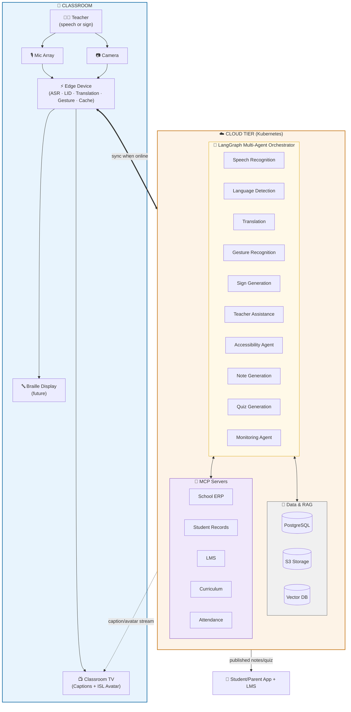

# SAKSHAM AI — Inclusive Classroom Intelligence Layer
### Real-Time Multimodal Accessibility System for Indian Classrooms
**Challenge 1 — The AI Systems Architect: Reimagining Work**

---

# 1. Executive Summary

**Problem statement**

India has ~26 lakh schools and ~1.5 crore+ children with disabilities, but <2% of mainstream classrooms have any real-time accessibility support for deaf, hard-of-hearing, blind, or speech-impaired students. Special educators are scarce (1 trained special educator per ~handful of schools in most districts), sign-language interpreters are nearly absent in mainstream govt schools, and Braille material production is slow and centralized. Meanwhile, every classroom already has the one piece of hardware needed to fix this: a **TV/smart display**, mandated and rolled out under Samagra Shiksha / PM SHRI / ICT @ Schools schemes.

**Target users**
- Deaf / hard-of-hearing students (need sign language + captions)
- Blind / low-vision students (need Braille + audio description)
- Speech-impaired teachers or students (need gesture-to-voice)
- Regional-language teachers (need real-time transcription/translation)
- School administrators (need compliance + analytics, zero extra staffing cost)

**Why this matters in India specifically**
- 22 scheduled languages + hundreds of dialects → no single sign language or speech model works nationally (Indian Sign Language itself has regional variation).
- Bandwidth is inconsistent in tier-3/4 towns and rural blocks → cloud-only AI fails. Needs edge-first design.
- RPWD Act 2016 mandates accessible education infra, but enforcement has no tooling — this becomes the tooling.
- Existing TV/display hardware investment is sunk cost we can reuse — zero new CapEx for displays.

**Core innovation**
A **multi-agent, edge-first transcription-to-everything pipeline** that takes one mic input from a teacher and fans out, in real time, into: live captions, ISL (Indian Sign Language) avatar rendering, translated audio/text, structured notes, quizzes, and (gesture-impaired teacher path) gesture-to-speech — all orchestrated by LangGraph agents running a hybrid edge/cloud topology, designed to degrade gracefully to **zero internet**.

**Expected impact**
- Per-classroom cost: one mic + existing TV + a low-cost edge box (~₹8–15k one-time) vs. hiring a dedicated interpreter (₹15-25k/month/classroom, practically impossible to scale).
- Addressable scale: 26L+ schools, ~95L+ classrooms with TVs already installed under ICT schemes.
- Direct outcome: a deaf child in a Tier-4 govt school gets the same real-time access to the lecture as a hearing child in a metro private school, for the first time, without a human interpreter being physically present.

---

# 2. System Architecture Overview

### Text diagram (layered view)

```
┌──────────────────────────────────────────────────────────────────────┐
│  TEACHER                                                              │
│  - Wears/uses lapel or desk mic                                       │
│  - Speaks in regional language (Hindi/Tamil/Bengali/etc.)             │
│  - OR signs (if speech-impaired) — captured via classroom camera      │
└───────────────────────────────┬──────────────────────────────────────┘
                                 ▼
┌──────────────────────────────────────────────────────────────────────┐
│  CLASSROOM EDGE DEVICE  (Raspberry Pi 5 / Jetson Orin Nano class box)  │
│  - Mic array input + classroom camera input                           │
│  - Local VAD (voice activity detection), noise suppression            │
│  - Local quantized ASR + gesture model (ONNX/GGUF)                    │
│  - Local cache: last N lectures, NCERT chapter embeddings             │
│  - Sync agent: queues data, syncs to cloud when link is up            │
└───────────────────────────────┬──────────────────────────────────────┘
                                 ▼
┌──────────────────────────────────────────────────────────────────────┐
│  AUDIO/VIDEO PROCESSING LAYER                                         │
│  - Streaming chunker (1.5–3s sliding windows, WebRTC VAD boundaries)   │
│  - Speaker diarization (teacher vs ambient classroom noise)           │
│  - Frame sampler for gesture/sign video (10–15 fps, keypoint extract) │
└───────────────────────────────┬──────────────────────────────────────┘
                                 ▼
┌──────────────────────────────────────────────────────────────────────┐
│  AI AGENT LAYER (LangGraph multi-agent orchestration)                 │
│  Speech Recognition → Language Detection → Translation →              │
│  Sign Generation / Gesture Recognition → Teacher Assist →             │
│  Note Gen → Quiz Gen → Monitoring  (full detail in Section 3)         │
└───────────────────────────────┬──────────────────────────────────────┘
                                 ▼
┌──────────────────────────────────────────────────────────────────────┐
│  ACCESSIBILITY LAYER                                                  │
│  - Caption renderer (multi-language, WCAG-compliant contrast/sizing)  │
│  - ISL Avatar renderer (3D rigged avatar, viseme + gesture blending)  │
│  - TTS engine (gesture-impaired teacher → synthesized voice + caption)│
│  - Braille stream formatter (BRF output → refreshable Braille display)│
└───────────────────────────────┬──────────────────────────────────────┘
                                 ▼
┌──────────────────────────────────────────────────────────────────────┐
│  STUDENT INTERFACES                                                   │
│  - Classroom TV (captions + avatar split-screen, HDMI-CEC controlled) │
│  - Personal device app (low-bandwidth WebSocket client, for revision) │
│  - Braille display (USB/Bluetooth refreshable display, future phase) │
└───────────────────────────────┬──────────────────────────────────────┘
                                 ▼
┌──────────────────────────────────────────────────────────────────────┐
│  STORAGE & ANALYTICS                                                  │
│  - S3-compatible object store (raw audio, transcripts, notes)         │
│  - PostgreSQL (structured records: lectures, assessments, events)     │
│  - Vector DB (embeddings for RAG: NCERT + lecture history)            │
│  - Analytics dashboards (admin: usage, accessibility events, gaps)    │
└──────────────────────────────────────────────────────────────────────┘
```

### Mermaid diagram



### Component explanation

| Layer | Purpose | Key property |
|---|---|---|
| Classroom Edge Device | Runs latency-critical inference locally so the system works even with bad/no internet | Offline-capable, ~₹8-15k hardware |
| Audio/Video Processing | Cleans and chunks raw signal before it hits agents | Low-latency streaming (sub-second windows) |
| AI Agent Layer | The actual intelligence — decomposed into specialist agents instead of one giant model call | Composable, debuggable, independently scalable |
| Accessibility Layer | Converts agent outputs into the actual sensory channel a student needs (visual/sign/audio/tactile) | Multi-modal fan-out from one source stream |
| Student Interfaces | Where the output lands | Reuses existing TV hardware — zero new CapEx |
| Storage & Analytics | Persistence + RAG + admin visibility | Feeds back into Note/Quiz agents and compliance reporting |

---

# 3. Multi-Agent System Design

### Why LangGraph over a simple LangChain pipeline

A linear LangChain chain (`prompt → model → parser`) assumes **one input, one output, one path**. This system needs:

1. **Cyclic/stateful behavior** — the Monitoring Agent needs to watch other agents continuously and can trigger re-execution (e.g., re-run Speech Recognition if confidence < threshold). Chains don't loop; graphs do.
2. **Conditional branching at runtime** — if Language Detection says "Tamil," route to Tamil Translation; if Gesture Recognition fires (teacher signing), skip Speech Recognition entirely and route to Teacher Assistance Agent instead. This is a state machine, not a pipeline.
3. **Parallel fan-out with shared state** — Translation Agent's output needs to simultaneously feed Sign Generation, Note Generation, AND Accessibility Agent without re-running translation three times. LangGraph's shared state object handles this natively; chains would require manual orchestration glue code.
4. **Human-in-the-loop interrupts** — Teacher Assistance Agent must be able to pause the graph and surface a clarification prompt to the teacher's tablet ("Did you mean photosynthesis or respiration?") and resume from that exact state. LangGraph supports `interrupt()` checkpoints; LangChain chains don't have a resumable execution state.
5. **Persistence/checkpointing** — if the classroom edge device loses power mid-lecture, the graph state (what's been transcribed, translated, signed so far) needs to be recoverable from the last checkpoint. LangGraph's built-in checkpointer (SQLite/Postgres-backed) gives this for free.

A simple chain would need hand-rolled `if/else` glue, manual state passing, and no native interrupt/resume — essentially reimplementing LangGraph badly. LangGraph is the correct abstraction because **this is fundamentally a stateful, branching, partially-parallel workflow**, not a linear transformation.

### Agent specifications

#### 1. Speech Recognition Agent
- **Responsibilities:** Convert teacher's spoken audio chunks into text, in the original regional language, with timestamps and confidence scores.
- **Inputs:** 1.5–3s audio chunks (16kHz PCM) from Audio Processing Layer, classroom noise profile.
- **Outputs:** `{text, lang_hint, confidence, start_ts, end_ts}` streamed as partial + final hypotheses.
- **Tools used:** Streaming ASR runtime (ONNX Runtime / faster-whisper / vLLM-served Whisper variant), VAD pre-filter.
- **Models used:** Whisper-large-v3 (cloud, high accuracy) for sync mode; quantized Whisper-small / IndicWhisper (ONNX INT8) on-edge for offline mode.
- **Communication flow:** Pushes partial transcripts to shared graph state at every chunk boundary → triggers Language Detection Agent → triggers Monitoring Agent (confidence check).

#### 2. Language Detection Agent
- **Responsibilities:** Identify which of the 22+ languages/dialects is being spoken, handle code-switching (teachers often mix Hindi + English + regional terms mid-sentence).
- **Inputs:** Transcript text + audio language-ID features.
- **Outputs:** `{primary_lang, code_switch_segments[], script}`.
- **Tools used:** Lightweight LID classifier (fastText-style or IndicLID), running alongside ASR.
- **Models used:** IndicLID / AI4Bharat language identification models (open-source, lightweight enough for edge).
- **Communication flow:** Annotates the shared state object → conditionally routes graph execution to the correct Translation Agent variant (per-language adapter) or skips translation if target = source.

#### 3. Translation Agent
- **Responsibilities:** Translate transcript into target language(s) needed by students in that specific classroom (e.g., regional → English for a transfer student, or regional → simplified regional for an LD student).
- **Inputs:** Source text + detected language + target language list (per-classroom config, pulled from Student Records MCP).
- **Outputs:** `{translated_text, target_lang, alignment_map}` (alignment map needed for downstream sign-timing sync).
- **Tools used:** NMT inference server.
- **Models used:** AI4Bharat IndicTrans2 (open-source, built specifically for Indian language pairs — far better than generic NMT for this use case); fallback to NLLB-200 for less common pairs.
- **Communication flow:** Fans out in parallel to Sign Language Generation Agent, Note Generation Agent, and Accessibility Agent (captions) simultaneously via LangGraph's parallel node execution.

#### 4. Sign Language Generation Agent
- **Responsibilities:** Convert translated/aligned text into ISL gloss sequence, then into avatar animation commands.
- **Inputs:** Translated text + alignment map + timing info (must stay sync'd with teacher's live pace).
- **Outputs:** ISL gloss sequence + avatar bone/blendshape animation frames (or pre-cached clip IDs for common phrases).
- **Tools used:** Text-to-gloss rule engine + ML-based gloss generator, 3D avatar rendering engine (rigged model, runs as a lightweight render on edge device or in TV's companion box).
- **Models used:** Fine-tuned seq2seq gloss generator (custom-trained on ISL corpus — this is a genuine R&D gap in India today, framed honestly as a phased rollout: Phase 1 = common classroom-phrase library + finger-spelling fallback for OOV terms; Phase 2 = full generative gloss model as ISL corpora mature, e.g., ISLRTC datasets).
- **Communication flow:** Receives from Translation Agent → outputs to Accessibility Agent for avatar rendering on TV → Monitoring Agent checks sync drift (audio-to-sign lag must stay <500ms).

#### 5. Gesture Recognition Agent
- **Responsibilities:** When the *teacher* is speech-impaired, capture their hand signs via classroom camera and recognize them as structured language input.
- **Inputs:** Camera frames (10-15fps), hand/body keypoints.
- **Outputs:** `{recognized_gloss_sequence, confidence}`.
- **Tools used:** Pose/hand keypoint extractor (MediaPipe Hands/Pose, runs on-edge), gesture classifier.
- **Models used:** MediaPipe (Google, open-source, edge-optimized) for keypoints → lightweight transformer classifier fine-tuned on ISL gestures for gloss recognition.
- **Communication flow:** Bypasses Speech Recognition Agent entirely, feeds directly into Teacher Assistance Agent (which converts gloss → natural sentence → TTS + caption), tagged so downstream agents know this came from sign input not speech.

#### 6. Teacher Assistance Agent
- **Responsibilities:** The "co-pilot" — assembles recognized gloss/speech into coherent natural-language sentences, handles ambiguity (asks for clarification via interrupt), and converts gesture-input into synthesized speech + captions for the *hearing* students when teacher signs instead of speaks.
- **Inputs:** Gloss sequences (from Gesture Agent) OR raw transcript (from Speech Agent) + lecture context (current NCERT chapter, from RAG).
- **Outputs:** Natural language sentence, synthesized audio (if gesture-input path), confidence-gated clarification prompts.
- **Tools used:** LLM call (small, fast model) for gloss→sentence reconstruction, TTS engine.
- **Models used:** A small instruction-tuned model served via vLLM/Ollama on-prem (e.g., Llama-3.1-8B-Instruct quantized) for low-latency reconstruction; Indic TTS (AI4Bharat / Coqui) for voice synthesis.
- **Communication flow:** Outputs to Accessibility Agent (captions + audio) and back to Monitoring Agent for quality logging; can trigger a `graph.interrupt()` to surface a clarification UI on the teacher's tablet.

#### 7. Accessibility Agent
- **Responsibilities:** The orchestration supervisor for all sensory output channels — decides, per enrolled student profile (from Student Records MCP), which output modalities to actively render (captions only? captions + avatar? + Braille stream?).
- **Inputs:** All upstream agent outputs + classroom's registered accessibility needs.
- **Outputs:** Routed render commands to TV, personal devices, Braille formatter.
- **Tools used:** Rules engine + MCP client (Student Records MCP for accessibility profile lookup).
- **Models used:** No heavy model — mostly a deterministic routing/policy layer (occasionally a small classifier to detect rendering conflicts, e.g., screen too cluttered with both captions + large avatar on a small TV → auto-prioritize).
- **Communication flow:** Sits "above" Sign Generation, Translation, and Teacher Assistance outputs — final gate before anything hits Student Interfaces.

#### 8. Note Generation Agent
- **Responsibilities:** Convert the full lecture transcript (translated, cleaned) into structured study notes per NCERT chapter format.
- **Inputs:** Full translated transcript + RAG context (matching NCERT chapter content) + lecture metadata.
- **Outputs:** Structured Markdown/PDF notes with headings, key terms, diagrams flagged for insertion.
- **Tools used:** RAG retriever + summarization LLM.
- **Models used:** Mid-size instruction model (served via vLLM) with NCERT-grounded RAG context to reduce hallucination.
- **Communication flow:** Runs asynchronously (not real-time critical) post-lecture or in rolling 5-minute windows → writes to PostgreSQL + S3 → triggers Quiz Generation Agent.

#### 9. Quiz Generation Agent
- **Responsibilities:** Generate formative assessment questions (MCQ/short-answer) from the generated notes, calibrated to the chapter's actual NCERT learning outcomes.
- **Inputs:** Structured notes + curriculum learning outcomes (Curriculum MCP).
- **Outputs:** Quiz JSON (questions, options, answer key, difficulty tag).
- **Tools used:** RAG + structured-output LLM call (JSON mode).
- **Models used:** Same class of model as Note Generation, prompted for structured JSON output.
- **Communication flow:** Triggered by Note Generation Agent completion → writes to PostgreSQL → exposed via LMS MCP for teacher review/publish.

#### 10. Monitoring Agent
- **Responsibilities:** Cross-cutting observability — watches confidence scores, latency, sync drift (audio-to-sign-avatar lag), and edge-device health; triggers fallbacks (e.g., switch to cached common-phrase sign clips if live generation lags).
- **Inputs:** Telemetry from every other agent (latency, confidence, queue depth).
- **Outputs:** Alerts, fallback triggers, logs to analytics.
- **Tools used:** Lightweight rules/anomaly detection, not a heavy model.
- **Models used:** Statistical thresholding initially; optional lightweight anomaly-detection model later.
- **Communication flow:** Subscribes to all agent state updates in the LangGraph shared state (read-only observer node), can emit control signals back into the graph (e.g., force a "degrade to captions-only" state transition).

### Why this needs a supervisor pattern, not a flat chain
The **Accessibility Agent** and **Monitoring Agent** both act as LangGraph supervisor-style nodes that read shared state and conditionally re-route execution — this supervisor pattern is exactly what LangGraph's graph-with-conditional-edges model is built for, and is awkward to replicate in plain LangChain.

---

# 4. Technology Stack

| Category | Tech | Why |
|---|---|---|
| **Frontend** | Next.js | SSR for fast TV-display boot, file-based routing for multi-surface UI (TV view, student app, admin dashboard) from one codebase |
| | TypeScript | Type safety across agent-output schemas shared with backend (catch contract breaks at compile time) |
| | Tailwind CSS | Rapid, consistent accessibility-compliant styling (contrast ratios, font scaling) without bespoke CSS sprawl |
| | Shadcn UI | Accessible-by-default component primitives (Radix under the hood) — critical since this IS an accessibility product |
| | WebSockets | Sub-second caption/avatar updates to TV and student devices; HTTP polling can't hit the latency bar |
| **Backend** | FastAPI | Async-native Python, ideal for streaming AI inference endpoints; auto OpenAPI docs ease MCP/integration work |
| | Python | Ecosystem alignment with ASR/NLP/CV models (HuggingFace, ONNX, PyTorch) |
| | Celery | Background jobs for non-real-time work: note generation, quiz generation, batch translation re-runs |
| | Redis | Celery broker + pub/sub for agent-to-agent fast messaging + caching hot model outputs (common phrases) |
| **Database** | PostgreSQL | Relational integrity for schools/classrooms/students/assessments — this is inherently relational data |
| | Redis | Hot-path cache + session state + Redis Streams for real-time agent event bus |
| | Vector DB (Qdrant/pgvector) | RAG retrieval over NCERT corpus + lecture history embeddings |
| **AI Infra** | LangChain | Utility layer for prompt templates, output parsers, individual tool wrappers used inside LangGraph nodes |
| | LangGraph | Stateful multi-agent orchestration (justified in Section 3) |
| | MCP | Standardized agent access to School ERP/Student Records/LMS/Curriculum without bespoke integration code per agent |
| | RAG | Grounds Note/Quiz/Teacher-Assist agents in actual NCERT content — reduces hallucination, keeps content curriculum-aligned |
| | HuggingFace | Model hub + `transformers`/`optimum` for exporting models to ONNX for edge deployment |
| | ONNX Runtime | Cross-platform, hardware-accelerated inference on edge devices (ARM-based Pi/Jetson) where PyTorch is too heavy |
| | vLLM | High-throughput LLM serving in the cloud tier (Teacher Assist, Note/Quiz Gen) — batches requests across many classrooms efficiently |
| | Ollama | Simple local LLM serving for edge/offline fallback mode on more capable edge boxes (Jetson-class) |
| **Realtime Infra** | WebRTC | Low-latency audio/video capture transport from classroom mic/camera to edge processing |
| | WebSockets | Agent-output-to-display streaming (captions, avatar frames) |
| | Redis Streams | Durable, ordered event bus between agents — survives brief consumer disconnects, unlike plain pub/sub |
| **Storage** | S3-compatible (MinIO self-host or AWS S3) | Cheap, durable storage for raw audio archives, generated notes, avatar clip cache; MinIO option lets state-level deployments self-host for data sovereignty |
| **DevOps** | Docker | Consistent packaging across cloud servers and edge boxes (same image, different resource limits) |
| | Kubernetes | Cloud-tier orchestration: autoscaling agent workers per classroom load, multi-tenant isolation per school/district |
| | CI/CD | Automated testing of agent graphs (regression-test transcription/translation accuracy on every model/prompt change) before rollout to live classrooms |

---

# 5. AI Models Selection

| Task | Primary (open-source, edge-friendly) | Alternative | Why prioritized |
|---|---|---|---|
| Speech-to-Text | IndicWhisper / faster-whisper (Whisper-small, INT8 ONNX) | Whisper-large-v3 (cloud only), AI4Bharat Conformer models | Indian-language fine-tuned, runs quantized on ARM edge boards |
| Translation | AI4Bharat IndicTrans2 | NLLB-200 (Meta), Google Translate API (paid fallback) | Purpose-built for India's 22 languages, beats generic NMT on Indic pairs |
| Sign Language Generation | Rule-based gloss engine + curated clip library (Phase 1) → fine-tuned seq2seq gloss model (Phase 2) | Avatar engines from academic ISL corpora (ISLRTC-derived) | Honest framing: production-grade generative ISL is an open research gap; phased approach ships value now |
| Gesture Detection | MediaPipe Hands/Pose + lightweight transformer classifier | OpenPose (heavier, less edge-friendly) | MediaPipe is the only option with real edge performance on low-cost hardware |
| OCR (textbook/board capture, future) | PaddleOCR / Tesseract w/ Indic language packs | Cloud OCR APIs | Open-source, supports Devanagari & other Indic scripts out of box |
| Summarization (Notes) | Llama-3.1-8B-Instruct (quantized, vLLM-served) | Mistral-7B-Instruct, IndicBART for regional-language notes | Good quality/latency tradeoff, self-hostable, no per-token API cost at scale |
| Quiz Generation | Same base model as summarization, JSON-mode prompted | GPT-4o-mini via API (fallback for districts wanting higher quality, paid tier) | Reuse infra, avoid maintaining a second model class |
| Local Classroom Inference | Whisper-small ONNX INT8 + IndicTrans2 distilled + MediaPipe | Larger models only when edge box is Jetson-class (not Pi-class) | Must run on ~₹8-15k hardware with no internet |

**Edge deployment priority order:** ASR > Language ID > Translation > Gesture Detection > Sign Gloss (lookup-based) — heavier generative sign avatar rendering and LLM-based note/quiz generation are cloud-tier-only and queue for sync when connectivity returns.

---

# 6. Edge AI Architecture

**Runs locally (on classroom edge box):**
- VAD, noise suppression, speaker diarization
- Quantized ASR (Whisper-small/IndicWhisper INT8 via ONNX Runtime)
- Language ID
- Distilled/quantized translation model for the classroom's most common 1-2 target languages (pre-configured per school)
- MediaPipe gesture/keypoint extraction + gesture classifier
- Common-phrase ISL clip lookup (cached library covering high-frequency classroom vocabulary: "open your books," "today we will study," subject-specific terms)
- Local cache of last N lectures + current chapter's NCERT embeddings (for offline Note Gen fallback, lower quality but functional)

**Runs in the cloud:**
- Full Whisper-large-v3 ASR (when online, for higher accuracy reconciliation — edge result gets silently upgraded/corrected)
- Full IndicTrans2 for all 22 language pairs (edge only carries 1-2)
- Generative ISL gloss model (Phase 2) — heavier, needs more compute than edge box has
- Teacher Assistance Agent's LLM reconstruction calls (vLLM-served, needs GPU)
- Note Generation + Quiz Generation (LLM + RAG, GPU-bound)
- Cross-classroom analytics aggregation

**Synchronization:**
- Edge box maintains a local **write-ahead queue** (SQLite-backed) of all events: transcripts, translations, gesture events, accessibility events.
- A lightweight **Sync Agent** (part of the edge stack, not the LangGraph cloud agents) batches and pushes queued events to cloud via S3 multipart upload + Postgres write API whenever connectivity is detected (periodic heartbeat ping).
- Conflict resolution: edge-generated transcript is the source of truth until cloud reconciliation arrives; cloud reconciliation overwrites only the *stored* transcript (for notes/analytics), never retroactively changes what was already shown live to students.
- LangGraph checkpointer state itself is stored locally first (SQLite checkpointer), mirrored to Postgres on sync — so a graph mid-execution survives a power cut.

**Offline mode:**
- Captions: fully functional (edge ASR + cached/distilled translation).
- ISL Avatar: functional for cached common-phrase library; for out-of-vocabulary content, fallback to finger-spelling mode or text-caption-only with a clear "limited sign coverage — offline mode" indicator (never silently degrade without telling the student/teacher).
- Notes/Quiz: queued, generated locally in degraded form (extractive summary instead of LLM-generated, using simple text-rank style algorithms that run without a GPU) until sync restores full LLM-based generation.
- Admin dashboard shows a clear "last synced: X minutes ago" per classroom so districts know which schools are running offline.

---

# 7. MCP Integration

| MCP Server | Why useful | Agent interactions | Data flow |
|---|---|---|---|
| **School ERP MCP** | Single source of truth for school/classroom/teacher registry — avoids duplicating enrollment data | Accessibility Agent queries it to resolve "which classroom is this edge device attached to" | Edge device ID → School ERP MCP → classroom context → injected into LangGraph initial state |
| **Student Records MCP** | Holds each student's registered accessibility needs (deaf/blind/etc.), consented and managed by school admin, not inferred by AI | Accessibility Agent reads this every session to decide which modalities to activate | Classroom ID → Student Records MCP → list of active accessibility profiles → routing policy |
| **LMS MCP** | Where generated notes/quizzes get published for students/parents to access post-lecture | Note Gen + Quiz Gen Agents push final artifacts here | Note/Quiz Agent output → LMS MCP write → visible in existing school LMS, no new app to learn |
| **Attendance MCP** | Cross-reference: which students were actually present for a lecture (relevant for personalized note delivery — don't push notes to absent students' accessibility-priority queue) | Note Gen Agent reads attendance before flagging "priority delivery" students | Attendance MCP → filtered student list → personalization layer |
| **Curriculum MCP** | Maps current lecture to official syllabus/learning-outcome IDs, so generated notes/quizzes are traceable to curriculum standards (important for state education board audits) | Note Gen + Quiz Gen Agents query this to ground RAG retrieval in the *correct* chapter, not just semantically similar content | Lecture metadata (subject, grade, date) → Curriculum MCP → chapter/LO IDs → RAG filter |

**Why MCP specifically (vs. bespoke REST integrations per school's ERP vendor):** Indian schools run wildly heterogeneous ERP/LMS systems (state-specific portals, private vendors like Entab, custom-built district systems). MCP gives agents a **standardized tool-calling interface** regardless of which vendor sits behind it — onboarding a new school/district means writing one new MCP server adapter, not modifying every agent's integration code.

---

# 8. RAG Architecture

**Knowledge sources:**
- NCERT textbooks (all grades/subjects, structured by chapter)
- State board textbooks (where state ≠ NCERT, e.g., Tamil Nadu, Maharashtra state boards)
- Lecture transcripts (this classroom's history — for "what did we cover last week" continuity)
- Previous classes (cross-classroom anonymized corpus, for note-quality improvement — opt-in, privacy-reviewed)
- Teacher notes (manually uploaded supplementary material per teacher)

**Chunking strategy:**
- Textbooks: chapter-aware semantic chunking (~300-500 tokens per chunk, split at section/subsection boundaries, never mid-paragraph) — preserves pedagogical structure so retrieved chunks are coherent teaching units, not arbitrary text slices.
- Lecture transcripts: rolling 2-3 minute windows aligned to natural pause boundaries (from VAD silence detection), tagged with timestamp + speaker turn.
- Overlap of ~10-15% between chunks to avoid context loss at boundaries.

**Embedding model:** Multilingual embedding model with strong Indic language coverage (e.g., AI4Bharat's IndicBERT-based embeddings or a multilingual-e5 variant) — must embed both the original regional-language transcript AND the textbook content in a comparable vector space.

**Vector database:** Qdrant (self-hostable, good filtering support) or pgvector (if minimizing infra surface area matters more — reuses the existing PostgreSQL instance). Recommendation: **pgvector for v1** (operational simplicity, one less service to run per district deployment), migrate to dedicated Qdrant only if query volume at 100k-classroom scale demands it.

**Retrieval flow:**
1. Note/Quiz/Teacher-Assist agent issues a query (current lecture topic + recent transcript window).
2. Query embedded → similarity search against NCERT/state-board chunks, filtered by `grade + subject + (optionally) chapter_id` from Curriculum MCP — metadata filtering BEFORE vector search to avoid retrieving correct-sounding-but-wrong-grade content.
3. Top-k chunks (k=4-6) returned with citation metadata (book, chapter, page).
4. Chunks injected into the LLM prompt as grounding context, with explicit instruction to only generate claims supported by retrieved content.

**Hallucination prevention:**
- Mandatory citation requirement in prompt: every generated note/quiz fact must be traceable to a retrieved chunk; agent output includes chunk references, surfaced to teacher for spot-checking before publish.
- Curriculum MCP metadata filtering prevents cross-grade/cross-subject contamination at retrieval time (most hallucination in educational RAG comes from retrieving *plausible but wrong-level* content, not from the generation step itself).
- Confidence gating: if retrieval similarity score is below threshold (no good grounding chunk found), agent flags the note section as "needs teacher review" instead of generating ungrounded content.
- Teacher-in-the-loop: all auto-generated notes/quizzes are marked "AI-generated draft" and require one-tap teacher approval before publishing to LMS MCP — never auto-published without human review.

---

# 9. Database Design

### Entity Relationship Diagram (Mermaid)



### Key tables and relationships (summary)
- `schools` → `classrooms` → `students` / `lectures` forms the core hierarchy (1 school : many classrooms : many students/lectures).
- `edge_devices` is 1:1 with `classrooms` — every classroom has exactly one edge box, tracked for sync health monitoring (feeds Monitoring Agent + admin dashboard).
- `accessibility_profiles` is intentionally separate from `students` (not a column on the student table) because a student can have multiple needs and profiles carry their own consent metadata — this table is the one Accessibility Agent reads via Student Records MCP.
- `transcripts` stores both raw and translated text with confidence scores — this dual storage is what lets Monitoring Agent retroactively audit translation quality and what feeds the RAG lecture-history corpus.
- `accessibility_events` is an append-only log (avatar rendered, caption shown, Braille stream sent, fallback triggered) — this is the compliance/audit trail proving the system actually served each student, important for RPWD Act reporting.
- `generated_notes` and `assessments` both carry a `status`/`approved_by` field enforcing the human-in-the-loop publish gate described in Section 8.

---

# 10. Data Flow

**Step-by-step, teacher speaks → student sees sign avatar + gets notes:**

1. **Teacher starts speaking** (t=0ms) — mic captures audio continuously, classroom camera idle unless gesture mode active.
2. **Audio capture** (t=0–200ms) — WebRTC client on edge device streams raw PCM, VAD detects speech onset within ~100-150ms.
3. **Chunking** (rolling) — 1.5-3s sliding windows handed to ASR as soon as a natural pause or window boundary is hit.
4. **Transcription** (t≈300-600ms after chunk close, edge) — Whisper-small ONNX INT8 returns partial hypothesis; cloud Whisper-large reconciliation arrives ~1-2s later if online, silently upgrading the stored (not live-displayed) transcript.
5. **Language detection** (near-instant, <50ms, runs alongside ASR) — confirms language, flags any code-switch segments.
6. **Translation** (t≈+200-400ms on edge for pre-cached language pair; +400-800ms cloud for full IndicTrans2 pass) — produces target-language text + alignment map.
7. **Parallel fan-out** (t≈+50ms after translation completes):
   - → Sign Language Generation Agent starts gloss conversion + avatar animation lookup/generation.
   - → Accessibility Agent pushes caption text to TV/device via WebSocket.
   - → Note Generation Agent appends to rolling buffer (not rendered live, batched).
8. **Sign avatar render** (t≈+150-300ms after gloss ready, cached-clip path; +500ms-1s for generative gloss path) — avatar frames streamed to TV.
9. **Student consumption** — captions appear at roughly **t ≈ 1-1.5s** after teacher speaks (edge, cached language); **t ≈ 2-3s** for cloud-reconciled/full-language-pair path. Avatar trails captions by an additional **~300ms-1s** depending on gloss complexity.
10. **Note generation** — runs in 5-minute rolling batches (not per-sentence), RAG-grounded, full pass takes **~10-20s** of LLM time per batch, async, never blocks live delivery.
11. **Storage** — every transcript segment, translation, and accessibility event is written to Postgres + S3 within the same request cycle (or queued locally if offline, synced later per Section 6).

**Latency budget summary:**

| Stage | Online (cloud-assisted) | Offline (edge-only) |
|---|---|---|
| Speech → caption | ~1.5-3s | ~1-1.5s (lower accuracy) |
| Speech → sign avatar | ~2-4s | ~1.5-2.5s (cached phrases only) |
| Lecture → notes available | end of 5-min batch + ~15s | end of session, extractive fallback |
| Lecture → quiz available | post-notes + ~10-15s | queued until sync |

This is well within usable real-time range for live classroom following — comparable to or better than human interpreter lag in practice.

---

# 11. Scalability Architecture

**1 classroom:**
- One edge device + one TV. All real-time inference local or via lightweight cloud calls. Trivial load on central infra (a few KB/s of event traffic).

**1,000 classrooms:**
- Cloud tier: a Kubernetes cluster with autoscaled pods for Translation/Note/Quiz agent workers, fronted by a load balancer; vLLM serving instances handle batched LLM calls across classrooms (batching is where vLLM's throughput advantage actually pays off — many concurrent small requests batch efficiently).
- Redis Streams as the event bus scales horizontally via Redis Cluster if a single instance's throughput is exceeded (unlikely at this scale, but planned for).
- Postgres: single primary + read replica sufficient; partitioning by `school_id` not yet necessary.
- **Bottleneck emerging here:** generative ISL avatar rendering (Phase 2 model) is the most compute-heavy step — needs dedicated GPU pool, separate autoscaling group from the lighter ASR/translation workers.

**100,000 classrooms:**
- Postgres: must shard/partition by state or district (data sovereignty also pushes this direction — many states prefer their data hosted in-state).
- Vector DB: move from pgvector to dedicated Qdrant cluster, sharded by curriculum board (NCERT vs. state boards) since retrieval is filtered by that dimension anyway.
- vLLM serving: multi-region GPU clusters, regional routing (a classroom in Tamil Nadu shouldn't have its LLM call routed to a Delhi data center — adds latency and cost).
- Redis Streams → consider Kafka migration if cross-region durability/replay guarantees become necessary at this volume (Redis Streams' replication story is weaker than Kafka's at multi-datacenter scale).
- Edge-first design pays off massively here: **the majority of "100,000 classroom" load is actually absorbed by edge devices**, not the cloud — cloud tier only handles reconciliation, heavy-generation tasks, and analytics aggregation, not every raw inference.

**Bottlenecks (general):**
1. Generative ISL avatar model compute (most expensive per-unit inference in the whole system).
2. Cross-region LLM latency if routing isn't state/region-aware.
3. S3-compatible storage egress costs at scale if raw audio is retained indefinitely (mitigate: tiered retention — raw audio purged after N days once transcript+notes are confirmed accurate, only transcripts kept long-term).

**Horizontal scaling approach:** every agent in the LangGraph graph is deployed as an independently scalable worker pool (stateless workers reading from Redis Streams), so ASR load and Note-Gen load can scale independently — a spike in live classrooms doesn't starve the batch note-generation queue, and vice versa.

**Cost optimization:**
- Edge-first reduces cloud GPU-hours per classroom by an order of magnitude vs. cloud-only design.
- Quantized models (INT8 ONNX) cut edge hardware cost requirements (Pi-class instead of requiring Jetson everywhere).
- Common-phrase ISL clip caching avoids re-generating avatar animation for repeated classroom phrases.
- vLLM batching amortizes GPU cost across many concurrent low-traffic classrooms rather than provisioning per-classroom capacity.

---

# 12. Security & Privacy

- **Student privacy:** Accessibility profiles (disability status) are among the most sensitive data categories handled — stored with field-level encryption in Postgres, access restricted to Accessibility Agent's service identity and school admin roles only; never exposed in raw form to analytics dashboards (aggregated/anonymized only).
- **Data encryption:** TLS in transit everywhere (WebRTC/WebSocket/MCP calls); AES-256 at rest for S3 objects and Postgres encrypted columns (accessibility profiles, any biometric-adjacent gesture data).
- **Access control:** Role-based access (RBAC) — teacher sees their own classroom's data; school admin sees school-wide; district/state sees aggregated, de-identified analytics only by default, with a separate audited elevated-access path for legitimate compliance investigations.
- **FERPA/GDPR-style considerations (mapped to Indian context — DPDP Act 2023):** explicit guardian/student consent capture for accessibility profile data (stored in `consent_metadata`), data minimization (don't retain raw classroom audio longer than needed for quality assurance), right-to-erasure support (student/guardian can request profile + historical transcript deletion), data localization options (self-hosted MinIO + state-hosted Postgres instance for states requiring in-state data residency).
- **School data protection:** Edge device local storage is encrypted at rest (important since these are physically accessible devices in classrooms); device-level auth tokens scoped narrowly (an edge device can only write data for its own registered classroom, enforced at the API gateway, preventing a compromised device from accessing other classrooms' data).
- **Gesture/biometric sensitivity:** Hand-keypoint data from Gesture Recognition Agent is processed and discarded after gloss extraction — raw camera frames are NOT retained by default (only derived keypoints briefly, then discarded), since camera footage of children is an especially sensitive data category.

---

# 13. Innovation Layer — 10 features that differentiate this from "just a captioning app"

1. **AI Teaching Copilot** — proactively surfaces relevant NCERT diagrams/examples to the teacher's tablet mid-lecture based on what they're currently discussing (RAG-driven, not just passive transcription).
2. **Adaptive Accessibility Routing** — system learns per-classroom which modality combination actually gets used/engaged with (e.g., students glance at avatar but not captions) and auto-prioritizes screen real estate accordingly.
3. **Gesture-to-Voice for Speech-Impaired Teachers** — genuinely bidirectional accessibility (most systems only solve student-side deafness; this also unlocks teaching *careers* for speech-impaired educators).
4. **Offline-First Degradation with Transparency** — never silently fails; always tells the user which features are running in reduced/offline mode (Section 6), building trust instead of confusing partial functionality.
5. **Cross-Lecture Continuity Memory** — RAG over the classroom's own lecture history means Note Gen Agent can reference "as discussed last Tuesday" coherently, not just single-session summarization.
6. **Curriculum-Traceable Auto-Notes** — every generated note line traces back to a specific NCERT/state-board learning outcome ID, turning this into an audit-ready compliance tool for state education departments, not just a study aid.
7. **Common-Phrase ISL Clip Economy** — a shared, growing, crowdsourced-and-curated library of high-frequency classroom sign clips across schools, so accuracy/coverage compounds network-effect-style as more classrooms onboard (Phase 1 → Phase 2 generative bridge).
8. **Parent Insight Agent** — opt-in weekly digest to parents/guardians (via SMS/WhatsApp for low-smartphone-penetration households) summarizing what their child's class covered and any accessibility events flagged — extends reach beyond the classroom device.
9. **Multi-Tenant District Compliance Dashboard** — district/state admins get an aggregated, anonymized view of accessibility coverage across all schools — directly usable as RPWD Act compliance evidence, a feature procurement officers will specifically value.
10. **Emotion/Engagement Signal (cautious, opt-in, aggregate-only)** — lightweight, privacy-preserving aggregate engagement signal (e.g., are students visually oriented toward the TV) to help teachers gauge whether accessibility delivery is actually landing — explicitly NOT individual emotion-profiling, framed and implemented as classroom-level aggregate only to avoid surveillance overreach.

---

# 14. Hackathon Judge Perspective

**Strongest parts**
- The core insight — reusing existing TV infrastructure instead of proposing new hardware rollout — is the single strongest "why this can actually scale in India" argument. Most accessibility-tech pitches fail on deployment cost; this one starts from the deployment-cost answer.
- Bidirectional accessibility (gesture-impaired *teacher* support, not just deaf/blind *student* support) is a genuinely underexplored angle that differentiates from every "live captioning for classrooms" clone pitch.
- Edge-first, offline-degrading architecture directly answers the most obvious judge pushback ("this won't work without internet in rural India") before it's asked.

**Weakest parts**
- ISL generative avatar quality is the biggest technical risk — India lacks large, standardized ISL corpora compared to ASL; the Phase 1 (cached clips + fingerspelling fallback) honesty is good practice, but judges may probe how long Phase 2 realistically takes, and the team should have a credible answer (partnership with ISLRTC, academic corpus collaboration) rather than hand-waving "we'll train a model."
- Teacher Assistance Agent's clarification-interrupt UX needs a live demo to be convincing — "the graph can pause and resume" is an architecture claim that needs to be *seen* working, not just described.
- Cost claim (₹8-15k edge box) needs a bill-of-materials backup if directly challenged — judges with hardware background will ask for a real Jetson Nano/Pi 5 + mic + camera price breakdown.

**Technical risks**
- Audio-to-sign-avatar sync drift under load (Section 10's latency budget) — needs a live load-test demo, not just a claimed number, to be credible to technical judges.
- Code-switching (Hindi-English-regional mixed mid-sentence) is genuinely hard for both ASR and Translation agents — if the demo lecture script avoids code-switching, judges familiar with Indian classrooms will notice the dodge.
- MCP integration claims are architecturally sound but unverified against any *real* school ERP vendor's actual API surface — worth explicitly flagging as "integration adapter, scope TBD per vendor" rather than implying universal plug-and-play.

**How to improve score**
- Build a **working demo of just the core loop** (mic → caption + cached-clip avatar on a real or simulated TV display) rather than only presenting architecture slides — judges weight working code heavily over diagrams alone.
- Have one slide that explicitly says "Phase 1 ships in months, here's exactly what; Phase 2 (generative ISL) is a 12-18 month research-backed roadmap" — this kind of honesty about what's solved vs. what's aspirational scores better than overclaiming.
- Quantify the addressable market concretely in the pitch (cite the ~26L schools / RPWD Act mandate numbers from Section 1) — judges scoring "impact" want a number, not just "this helps many children."

---

# 15. Final Architecture Diagram (pitch-deck ready)



**One-line pitch for the deck:** *"Every Indian classroom already has a TV. We turn it into a real-time sign-language interpreter, live caption system, and personal note-taker — for the cost of a mic, not the cost of hiring a human interpreter, and it keeps working even when the internet doesn't."*